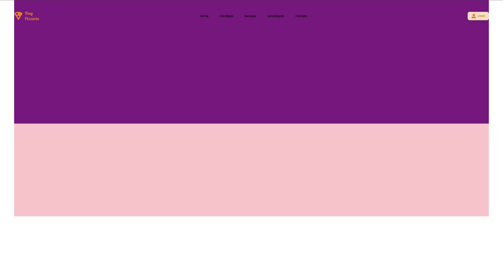

# 08-TonyPizzaria

Website criado com o auxilio do professor Leonid, com o objetivo de entender a criação de um site completo linha a linha.
Foi utilizado uma nova tag "menu" em html para a criação de um menu de navegação. 
Utilizamos a função calc para determinar a largura do header, devido a configuração de posição absoluta.
Também foi criado variaveis globais para as cores primárias e secundárias,

## Tecnologias
* HTML
* CSS
* Media Queries
* Figma

## Autor
[Kauan Lopes](https://www.linkedin.com/in/kauan-lopes-pereira-91b5a022a/)